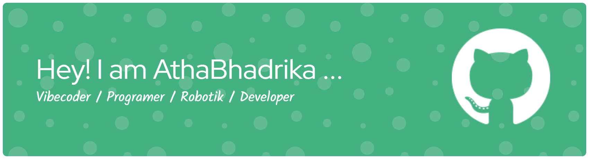

## HELLO WOl D!! I AM ATHA 👋

### 💫 About Me:

#### HELLO WORD!! I AM ATHA 👋

### 🌐 Socials:

  

### 💻 Tech Stack:

                                     

#### 📊 GitHub Stats:

 
 

---

<!-- Proudly created with GPRM ( https://gprm.itsvg.in ) -->

play game with me

###

###

<picture>
  <source media="(prefers-color-scheme: dark)" srcset="https://raw.githubusercontent.com/AthaBhadrika/AthaBhadrika/pacman-output/pacman-contribution-graph-dark.svg">
  <source media="(prefers-color-scheme: light)" srcset="https://raw.githubusercontent.com/AthaBhadrika/AthaBhadrika/pacman-output/pacman-contribution-graph.svg">
  
</picture>

###
